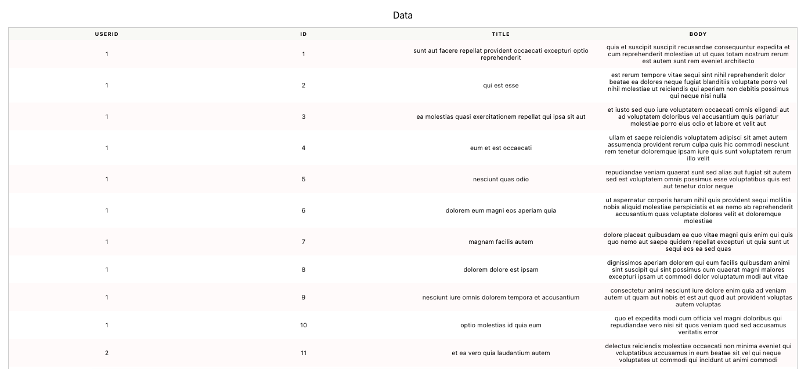

# Getting started

## Installing.

```text
npm i -s react-minimalist-table
```

Copy this code at you project in order to have a fully responsive table.

```javascript
import './App.css';
import {CTable} from 'react-minimalist-table';
import {useEffect, useState} from 'react';

function App() {

  const [Data, setData] = useState([])
   
  useEffect(() => {
    fetch('https://jsonplaceholder.typicode.com/posts')
    .then(response => response.json())
    .then(json => setData(json))
  }, [])

  return (
    <div className="App">
        <CTable 
          caption={"Data"}
          data={Data}
        />
    </div>
  );
}

export default App;

```




#### Props.

| caption | Title of the table to be displayed |
| :--- | :--- |
| data | JSON array with the data to be displayed |

#### Data example.

```javascript
[{
    columnName: cellValue,
    columnName2: cellValue2,
}]
```

